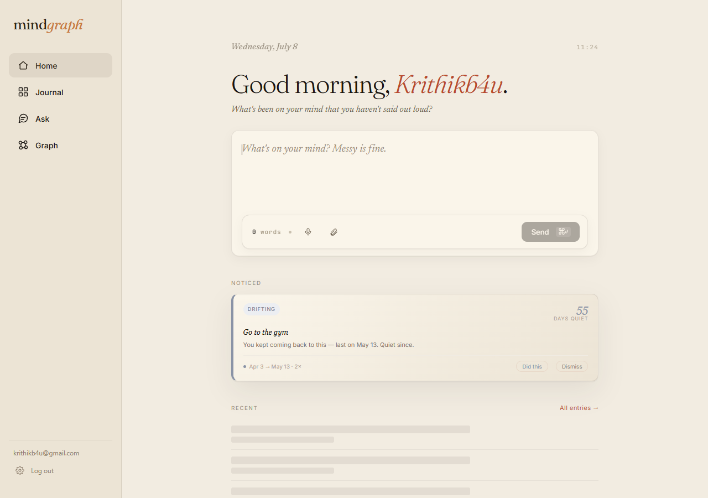
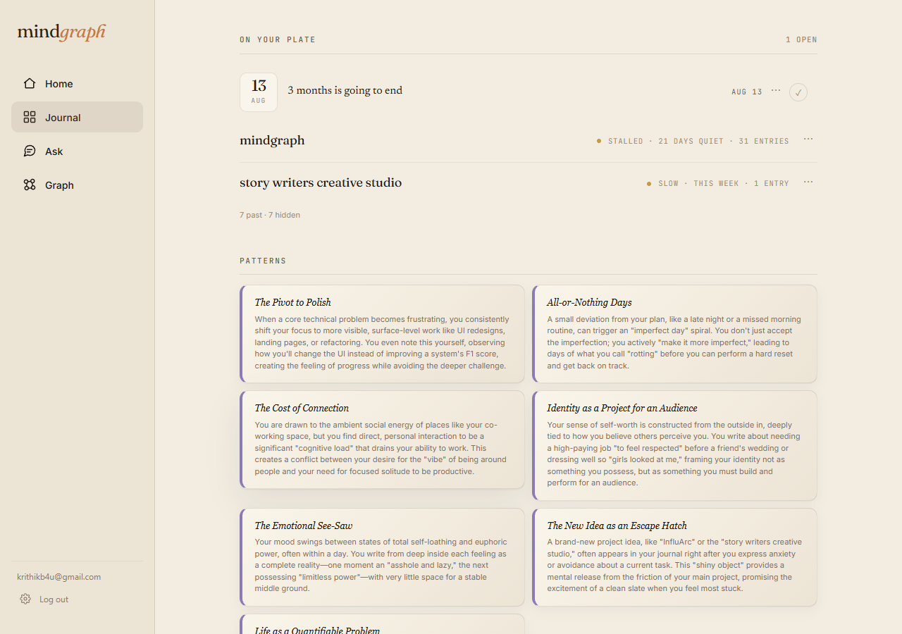
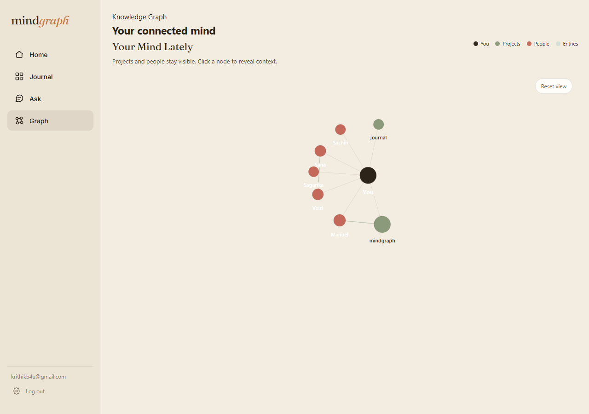

# MindGraph

**You dump. It organizes.** A journal that reads what you write and reflects it back — a mirror with memory, not a productivity tracker.

Write in plain, messy language. MindGraph extracts the people, projects, and deadlines you mention, notices the intentions that go quiet, synthesizes the patterns in how you actually think, and lets you ask questions about your own past in natural language.

**Live at [rawtxt.in](https://rawtxt.in)** · [API docs (Swagger)](https://mindgraph-production.up.railway.app/docs)

[](https://rawtxt.in)



---

## What it does

MindGraph is a **witness, not a manager**. It doesn't set goals for you, count streaks, or nag. It watches what you write over time and shows you what's there.

- **Capture-first journaling.** One composer. Write a thought — messy is fine — and it's acknowledged instantly while an 11-node pipeline processes it in the background. No forms, no fields, no tagging.
- **Drift detection.** MindGraph tracks the gap between *stated intent* and *behavior over time*. When something you kept returning to goes quiet, it surfaces one card — "you kept coming back to this; quiet since May 13" — without judgment. "Days quiet" is data, not a scold.
- **Reflection (self-synthesis).** An evolving, per-user document of the **non-obvious behavioral patterns** in your writing — who you are across your entries, not a mention-count summary. It rewrites itself from your full journal as you accumulate entries.
- **Ask — RAG over your own journal.** Natural-language questions answered with grounded retrieval over everything you've written, with conversation memory and temporal awareness. "What was I worried about in April?" gets a cited answer, not a hallucination.
- **Graph view.** An interactive, force-directed map of the people, projects, and entries in your life and how they connect.

The interface is four surfaces: **Home** (capture + what was noticed), **Journal** (one scrollable life view — deadlines, projects, patterns, entries), **Ask**, and **Graph**.





## Architecture

Two paths do the work: an **entry pipeline** that turns raw text into structured memory, and an **Ask path** that retrieves and grounds answers over it.

### Entry pipeline — FastAPI + LangGraph

A submission is acknowledged immediately (FastAPI `BackgroundTask`) and processed by a LangGraph DAG. `normalize` and `dedup` run first; on a duplicate the graph short-circuits to `END`. Otherwise five extractors fan out in parallel, then fan into relation-extraction and discovery-computation before the result is embedded and stored.

```
POST /entries/async ──► normalize ──► dedup ──┬─(duplicate)──► END
   (instant ack,                               │
    background task)             parallel      ├─► title_summary ┐
                                 fan-out ─────► ├─► classify       │
                                               ├─► entities        ├─► extract_relations ──┐
                                               ├─► deadline         │                       ├─► store ──► assemble_dispatch ──► Supabase
                                               └─► intentions ──────┴─► compute_discoveries ─┘        (Postgres + pgvector)
```

Entities are linked through a 3-stage match (normalized exact → project-normalized → semantic embedding) so name variants don't create duplicate rows. Embeddings are 1536-dim (`embedding-001`, task-type-aware).

### Ask path — hybrid retrieval + rerank + Gemini

```
POST /ask ──► query router ──┬─ temporal ──► date-range retrieval (embedding bypass)
                             │
                             └─ semantic ──► hybrid retrieval (BM25 + pgvector)
                                                     │
                                                     ▼
                                             Cohere Rerank v3.5
                                                     │
                                                     ▼
                                 context assembly (+ conversation memory / compaction)
                                                     │
                                                     ▼
                                     Gemini generation (Vertex AI) ──► grounded answer
```

Ask is **not** plain RAG: hybrid BM25 + pgvector retrieval, Cohere cross-encoder rerank, a temporal-routing bypass that answers date questions from structured tables directly, and per-session conversation memory with compaction.

## Engineering practices

- **RED-first evals.** New retrieval, extraction, and generation behavior starts as a *failing* eval case. Every run writes a SHA-stamped JSON to `evals/results/` (committed), and two runs are diffed with `evals/compare.py` — so quality changes are provable, not vibes.
- **Variance bands, N≥3.** LLM-as-judge scores are noisy, so eval decisions are made against multi-run variance bands rather than a single number — a change has to clear the noise band to count.
- **Drift is computed at read time, never stored.** The "drifting" card is scored per request (recency, reference count, maturity window, cooldown) from live intention state. There is no stale `drift` column to reconcile.
- **Backend-side analytics.** Product events (`drift_card_served`, `intention_resolved`, …) are emitted server-side via PostHog, so analytics don't depend on the client firing them.
- **Cost metering + caps.** Every LLM-billed request is metered (`app/services/cost_cap.py`), using the real Langfuse trace cost when available and a per-type estimate otherwise, with per-user caps.
- **Production smoke scripts.** Rendered, prod-facing smokes (`scripts/smoke_home_prod.js`, `scripts/smoke_journal_prod.js`, `scripts/verify_drift_pick_prod.py`) verify the live surfaces end-to-end after deploy.
- **Observability.** Langfuse traces every LLM call; Sentry catches backend and frontend errors.

## Stack

| Layer | Choice |
| --- | --- |
| Backend framework | FastAPI + Uvicorn |
| Pipeline orchestration | LangGraph + LangChain |
| Pipeline LLM | Gemini 2.5 Flash-Lite (`thinking_budget=0`) |
| Insights / eval-judge LLM | Gemini 2.5 Pro |
| LLM provider (prod) | Vertex AI (`USE_VERTEX=1`); Gemini API for local dev |
| Embeddings | `embedding-001`, 1536-dim, task-type-aware |
| Retrieval | Hybrid BM25 (tsvector/GIN) + pgvector cosine + **Cohere Rerank v3.5** + temporal routing |
| Database / auth | Supabase — Postgres + pgvector + Supabase Auth (JWT) |
| Frontend | React 19 (CRA) + custom D3 force-directed SVG graph + Framer Motion |
| Cache / rate state | Upstash Redis |
| Analytics | PostHog (backend + frontend) |
| Observability | Langfuse (LLM traces) · Sentry (errors) |
| Payments | Razorpay |
| Hosting | Railway (frontend + backend), Docker |

## Running locally

### Prerequisites

- Python 3.11+, Node.js 20+
- A Supabase project (Postgres + pgvector + `tsvector`/GIN + Auth)
- A Gemini API key (local dev) and, optionally, a Cohere API key for reranking

### Backend

```bash
python -m venv .venv
source .venv/bin/activate           # Windows: .\.venv\Scripts\Activate.ps1
pip install -r requirements.txt
uvicorn app.main:app --reload
```

Minimum backend environment to boot:

```env
SUPABASE_URL=
SUPABASE_SERVICE_ROLE_KEY=
GEMINI_API_KEY=
COHERE_API_KEY=          # optional — Ask falls back to un-reranked order if unset
CORS_ORIGINS=
```

Optional / production parity (each integration degrades gracefully when unset):

```env
# Vertex AI (production LLM path)
USE_VERTEX=1
VERTEX_PROJECT=
VERTEX_LOCATION=
GOOGLE_CREDENTIALS_JSON=          # service-account JSON; written to a temp creds file at boot

# Observability & analytics
LANGFUSE_PUBLIC_KEY=
LANGFUSE_SECRET_KEY=
LANGFUSE_BASE_URL=
SENTRY_DSN_BACKEND=
POSTHOG_API_KEY=

# Infra & payments
UPSTASH_REDIS_REST_URL=
UPSTASH_REDIS_REST_TOKEN=
RAZORPAY_KEY_ID=
RAZORPAY_KEY_SECRET=
```

### Frontend

```bash
cd mindgraph-frontend
npm install
npm start
```

```env
REACT_APP_SUPABASE_URL=
REACT_APP_SUPABASE_ANON_KEY=
REACT_APP_API_URL=
REACT_APP_SENTRY_DSN=             # optional
```

In production on Railway, the frontend reads a `/env.js` file generated at container startup rather than build-time env. The backend service-role variable is `SUPABASE_SERVICE_ROLE_KEY` (not `SUPABASE_KEY`).

## Repo map

```
app/
  main.py                     # FastAPI app: all routes, auth, CORS
  graph.py · state.py         # LangGraph pipeline wiring + shared typed state
  nodes/                      # entry pipeline nodes (normalize, dedup, extractors, store, …)
  services/
    ask_pipeline/             # the Ask DAG (router, hybrid_rag, rerank, generation)
    ask_service.py            # retrieval thresholds + conversation memory
    cost_cap.py               # per-request cost metering + caps
  synthesis_engine.py         # reflection (self-synthesis) engine
  schemas/                    # structured-output schemas
mindgraph-frontend/           # React app; static landing pages in public/
evals/                        # eval harnesses + results/ (SHA-stamped run JSONs)
tests/                        # pytest suites
migrations/                   # numbered SQL, applied manually to Supabase
scripts/                      # backfills, prod smokes, screenshot capture
docs/                         # STATE.md, ADRs, screenshots
```

To derive the current surface from source rather than trusting this file:

- **Routes:** `grep -n "@app\." app/main.py`
- **Tests:** `pytest --collect-only -q tests/`
- **Latest eval scores:** newest `evals/results/*.json` → `summary`
- **Deployed commit:** `curl https://mindgraph-production.up.railway.app/health`

## License

MIT
